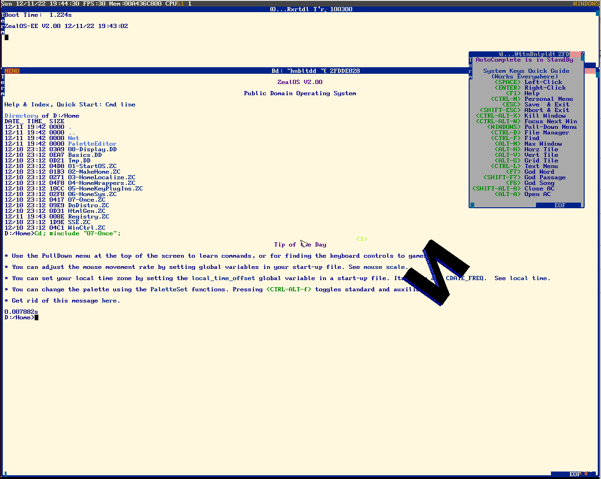

# TempleOS Explorers Edition

TempleOS was developed by the late Terry Davis and is a true testament to what a person can achieve, he single handedly developed and built the OS using a compiler he also developed. The system is "alien" to all its contemparies in that no external code or binary's can be introduced into the system (easily) or exported and run outside the environment.

The system has two pre-built binary's the Kernel and Compiler, at bootup the runtime environment is Just In Time (JIT) compiled and executed. The System is fast, the compiler is fast, in VirtualBox system startup time for me is around 0.4 seconds and that includes the compilation time of the runtime environment.

The compiler HolyC is a variant of C and there is some crossover, but there are enough differences that they are not compatible, IMHO HolyC is a better implementation, much more forgiving, more capable as a low level language, more capable as a general language simplified in the engineering sense where is easier to get things done, and it is clearer what is going on so other peoples code is much easier to follow, clearer and simpler in the engineering sense with no unnecessary complexity being added to an already complex domain.

He didn't re-write the book he built on the lessons of C and created a language which builds on the strengths, removes several complexities and weaknesses. But not all, pointer implementation as far as I can tell is implemented in the same way that it is implemented in C.

Explorers Edition builds on top of the base TempleOS to add new hardware support and installation options. 

What I interpret as Terry's intention for the OS will be honoured what I interpret as Gods intention will not, with the Ultimate Goal being a light weight Hobby OS, that is a fun place to explore and develop new ideas. Something that stands apart from the main stream Commercial OS's and is developed independently and encourages users to get in and get their hands dirty and try new things.

## Current Goals
The current Goals are to enable TempleOS to be installed natively and self contained on as many PC's as possible (the idea being no tools outside of TempleOS are required for Build, Boot, Install)

* Full UEFI boot compatability, natively inside TempleOS
* New Compiler backend to generate ARM Binaries (To allow TempleOS to run on metal on AN Apple M1 or Raspberry PI for example).

[Wiki](https://github.com/Slapparoo/TempleOS-EE/wiki)

[Boot TempleOS with Grub2](https://github.com/Slapparoo/TempleOS-EE/wiki/Boot-TempleOS-with-Grub2)

[Quick Customisation Tasks](https://github.com/Slapparoo/TempleOS-EE/wiki/Quick-Customisation-Tasks)

[Github project page](https://slapparoo.github.io/TempleOS-EE/)

[Github Source repository](https://github.com/Slapparoo/TempleOS-EE)

[ISO release TempleOS-EE 6.03](https://github.com/Slapparoo/TempleOS-EE/releases/tag/6.03-beta)

[Linux TempleOS utilities](https://github.com/Slapparoo/templeos-utils)

[discussions](https://github.com/Slapparoo/TempleOS-EE/discussions)

[Log a ticket, issue or feature request](https://github.com/Slapparoo/TempleOS-EE/issues) 

## Blog Posts
<ul>
  
    <li>
      <a href="{{ post.url }}">{{ post.title }}</a>
    </li>
  
</ul>

